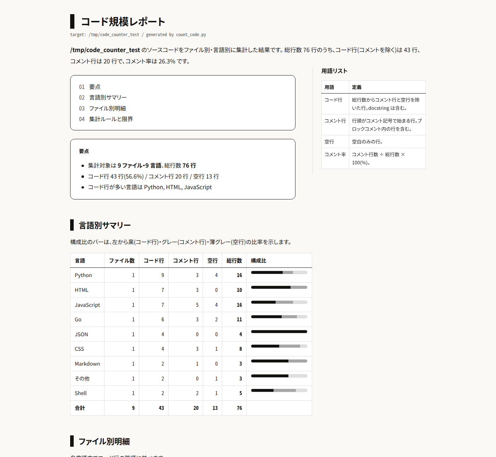

# code-counter

指定フォルダのソースコード規模を**ファイル別・言語別**に集計し、総行数を「コメントあり / なし」で整理するコマンドラインツールです。SKILL.md を同梱しているため、コーディングエージェントのスキルとしても利用できます。計測結果は、CSS を埋め込んだ単一ファイルの HTML レポートとして出力します。



## 特徴

- **約 40 言語に対応** — Python / JavaScript / TypeScript / Java / C 系 / Go / Rust / Ruby / Shell / SQL / HTML / CSS / YAML / JSON / Markdown など
- **コメント記法を字句解析** — 行コメント(`#` `//` `--` `%` `;`)とブロックコメント(`/* */` `<!-- -->`)を言語別に判定し、文字列リテラル内の `//` や `#`(URL など)を誤検知しない簡易トークナイザを内蔵
- **単一ファイルの HTML レポート** — html-create スキルのデザインシステムに沿ったスタイルを CSS ごと HTML に埋め込むため、ファイル 1 つをそのまま移動・共有できる
- **複数の出力形式** — HTML(既定)/ CSV / JSON / テキスト
- **依存なし** — Python 3 の標準ライブラリのみ。数万行のフォルダも 1 秒かからず集計

## セットアップ

追加のセットアップは不要です。Python 3 があれば、リポジトリをクローンした直後から実行できます(標準ライブラリのみを使用)。

コーディングエージェントのスキルとして使う場合は、リポジトリ直下の `code-counter/` を、エージェントがスキルを読み込むディレクトリ(例: ユーザー配下の `~/.agents/skills/`、プロジェクト配下の `.agents/skills/`)へコピーしてください。

```bash
mkdir -p ~/.agents/skills
cp -r code-counter ~/.agents/skills/
```

## 使い方

### コマンドラインで実行する

```bash
python3 code-counter/scripts/count_code.py <対象フォルダ>
```

実行するとカレントディレクトリに `{yyyymmdd}-code-scale-report.html` が生成されます。

```bash
# CSV で出力(データ再利用向け)
python3 code-counter/scripts/count_code.py src --format csv -o report.csv

# コンソールに概要だけ表示(言語ごとに上位 20 ファイル)
python3 code-counter/scripts/count_code.py src --format text --top 20

# 総行数の降順で並べ替え
python3 code-counter/scripts/count_code.py src --format text --sort total
```

| オプション | 説明 |
| --- | --- |
| `target` | 集計対象のフォルダ(必須) |
| `--format` | 出力形式。`html`(既定)/ `text` / `csv` / `json` |
| `--output, -o` | 出力ファイルのパス。省略時はカレントに日付付きファイル名 |
| `--sort` | 言語サマリーの並び順。`code`(既定)/ `total` / `files` |
| `--top N` | テキスト出力で言語ごとに表示するファイル数の上限 |
| `--no-ignore` | 除外ディレクトリ(`.git`、`node_modules` など)も集計する |

### エージェントのスキルとして使う

SKILL.md を解釈できるコーディングエージェントなら、次のような依頼でスキルが呼び出され、集計から結果の表整理まで自動で行われます。

- 「`src` フォルダのソースコードをファイル別・言語別に規模を整理して」
- 「このプロジェクトのコード量ってどれくらい?コメント抜きで」
- 「コメント率を集計して」

## 出力

### HTML レポート(既定)

CSS を埋め込んだ自己完結する 1 ファイルです。構成は次のとおり。

1. **要点** — ファイル数・言語数・総行数・コメント率のサマリー
2. **言語別サマリー** — ファイル数 / コード行 / コメント行 / 空行 / 総行数と、構成比バー(黒=コード / グレー=コメント / 薄グレー=空行)
3. **ファイル別明細** — 言語ごとにコード行の降順で一覧
4. **集計ルールと限界** — 判定条件と既知の制限の注記

デザインは `html-create` スキルのデザインシステム(背景 `#FAF9F6`、白地 + 黒罫線 + 角丸、字体は Ubuntu Sans / Noto Sans JP / Ubuntu Mono)に従います。

### CSV / JSON

ファイル単位の明細を機械可読で出力します。列は `language, file, total, code, comment, blank`。

## 集計ルール

| 種別 | 定義 |
| --- | --- |
| コード行 | 総行数 − コメント行 − 空行。Python の docstring(トリプルクォート)は文字列リテラルとしてコード行に数える |
| コメント行 | 行頭(空白を除く)がコメント記号で始まる行。ブロックコメント内の行を含む。行末コメント付きの行はコード行 |
| 空行 | 空白のみの行 |

既知の制限:

- ヒアドキュメントや C++ の生文字列リテラル内は判定しない
- `.h` は C、`.m` は Objective-C として判定する
- 拡張子が未知のテキストファイルは「その他」として総行数・空行のみ数える(コメント記法を判定できないため)

## 除外されるもの

- ディレクトリ: `.git` `node_modules` `vendor` `__pycache__` `venv` `.venv` `dist` `build` `target` `coverage` `.idea` `.vscode` など(`--no-ignore` で無効化)
- バイナリファイル(拡張子判定 + NULL バイト検査)
- 巨大ファイル(既知言語は 5MB、未知の拡張子は 1MB 超をスキップ)

## ディレクトリ構成

```text
code-countor/
├── README.md
├── code-counter/                  # スキル本体(SKILL.md + 計測スクリプト)
│   ├── SKILL.md                   # 発火条件・手順・集計ルール
│   ├── scripts/count_code.py      # 計測スクリプト(標準ライブラリのみ)
│   └── assets/design-system/      # html-create デザインシステムの CSS
│       └── document.css
└── docs/screenshot.png
```

## テスト

期待値を手計算した複数言語のフィクスチャで集計精度を検証できます。

```bash
# フィクスチャ作成(コメント・docstring・文字列内の記号・除外対象を含む)
bash -c 'mkdir -p /tmp/code_counter_test && cd /tmp/code_counter_test &&
printf "#!/usr/bin/env python3\n\"\"\"Sample module.\"\"\"\n# comment\nx = 1\n" > main.py &&
printf "// util\nconst a = 1;\n" > utils.js'

python3 code-counter/scripts/count_code.py /tmp/code_counter_test --format text
```

上のフィクスチャでは `main.py` が 総行数 4 = コード 2 + コメント 2(docstring はコード扱い)、`utils.js` が 総行数 2 = コード 1 + コメント 1 になれば正しく動作しています。
