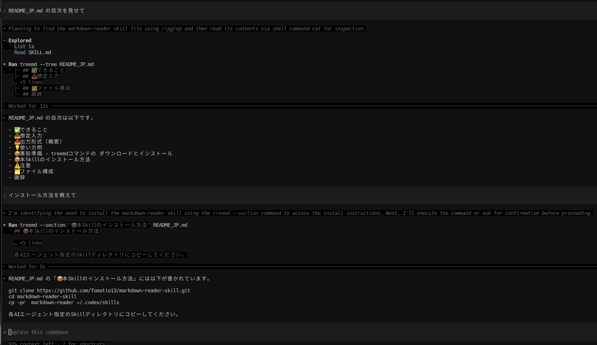

<h1 align="center">markdown-reader</h1>

<p align="center">
  
  
</p>

<p align="center">
  <a href="README_JP.md"></a>
  <a href="README.md"></a>
</p>

Markdown を段階的に読むための Agent Skill です。まず見出しツリーで全体像を把握し、必要なセクションだけを抽出して読みます。

## ✅ できること
- 🧭 見出しツリー（アウトライン）の取得
- ✂️ 必要な見出しセクションだけの抽出
- 🧩 段階的な読み込みで理解を深める

## 📥 想定入力
- README.md
- 仕様書・ガイドなどの Markdown

## 📤 出力形式（概要）
- 見出しツリー出力
- 指定セクションの抽出結果

## 💡 使い方例

AIエージェントに設定後、以下のように指示を出して下さい。

- 「この Markdown を markdown-reader で読んで」
- 「まずツリーを出して、次にこの章だけ読んで」

以下のように段階的に読み込むことができます。




## 📦 事前準備 - Python 3

Python 3 が必要です。`treemd` 互換の軽量スクリプトを同梱しています。
スキルの `scripts/` ディレクトリから実行してください。

## 📦 本Skillのインストール方法

```
git clone https://github.com/Tomatio13/markdown-reader-skill.git
cd markdown-reader-skill
cp -pr  markdown-reader ~/.codex/skills
```

各AIエージェント指定のSkillディレクトリにコピーしてください。


## ⚠️ 注意
- `--section` は見出し名の完全一致が基本
- 見出しが見つからない場合は表記や階層を見直す

## 🗂️ ファイル構成
- `markdown-reader/SKILL.md`
- `markdown-reader/scripts/md-index.py`
- `markdown-reader/references/md-index.md`

## 謝辞
- 互換 CLI の参考として [treemd](https://github.com/Epistates/treemd.git) に感謝します。
