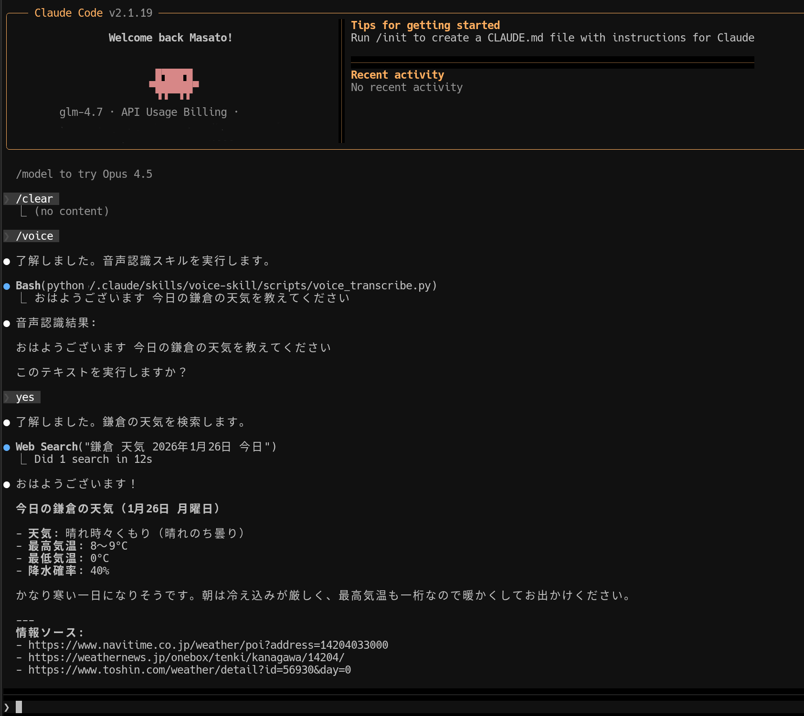

<h1 align="center">voice-skill</h1>
<p align="center">マイク録音して whisper.cpp で文字起こしする Agent Skill です。</p>

<p align="center">
  <a href="README_JP.md"></a>
  <a href="README.md"></a>
</p>
<p align="center">
  
  
  
</p>

## ✅ 必要要件

- Python 3
- 録音ツール: `arecord` (ALSA) または `ffmpeg`
- whisper.cpp CLI バイナリ（`whisper-cli`）

## ⚙️ 仕組み

1. `arecord` または `ffmpeg` でローカルで音声をします。
2. whisper.cpp CLI で文字起こしを行います。
3. 文字起こししたテキストをユーザに表示し、LLMに指示する確認します。
4. yesの場合は、LLMにテキストを渡してプロンプトとして実行します。

## 🚀 使い方

Claude CodeやCodexのSkillsフォルダにコピーした後、 voiceコマンドを実行してください。
音声から変換されたテキストを実行するか確認されるので、yes/noを答えて下さい。




## 🔧 環境変数
このSkillは、録音と音声テキスト変換を外部コマンドに依存しています。

### 録音:
ffmpegまたは、arecordが利用できる必要があります。
以下の環境変数を設定してください。

- `VOICE_RECORDER`: `arecord` または `ffmpeg` を強制指定
- `VOICE_SECONDS`: CLI引数なし時の録音秒数
- `VOICE_SILENCE_SECONDS`: 0より大きい場合、無音検出で停止（ffmpegのみ）
- `VOICE_SILENCE_NOISE`: ffmpeg の無音閾値。既定 `-40dB`

### 音声テキスト変換:
Whisper.cppが利用できる必要があります。
以下の環境変数を設定してください。

- `WHISPER_BIN` または `WHISPER_CPP`: whisper.cpp CLI バイナリのパス
- `WHISPER_CMD`: 完全なコマンドテンプレート。`{bin}`, `{model}`, `{audio}`, `{out}` を使用
- `WHISPER_MODEL_DIR`: モデル保存ディレクトリ
- `WHISPER_MODEL`: モデルのファイル名。既定は `ggml-base.bin`
- `WHISPER_ARGS`: 既定コマンドへの追加引数

### .envの例
以下のように作成し、`scripts`配下に配置してください。

```env
# whisper.cpp CLI バイナリ（必須: 実行ファイルのフルパス）
WHISPER_BIN=/path/to/whisper.cpp/build/bin/whisper-cli
WHISPER_CMD="{bin} -m {model} -f {audio} -l ja -otxt -of {out}"
# モデル設定（未指定なら ggml-base.bin）
WHISPER_MODEL=ggml-small.bin
WHISPER_MODEL_DIR=~/whisper_models
# 録音設定
VOICE_RECORDER=ffmpeg
VOICE_SECONDS=20
# 無音自動停止（ffmpegのみ）
VOICE_SILENCE_SECONDS=2
VOICE_SILENCE_NOISE=-40dB
```

- `WHISPER_BIN` はディレクトリではなく **実行ファイル** を指定してください。
- モデルが存在しない場合は自動ダウンロードし、`WHISPER_MODEL_DIR`に保存されます。
- `ffmpeg` を使うと **無音検知で自動停止**が可能です。

## 🧰 インストール（最小）
依存コマンドをインストール/ビルドし、`WHISPER_BIN` に whisper.cpp の
バイナリパスを指定してください。`ffmpeg` か `arecord` が PATH 上にある
必要があります。

## [参考] Whisper.cppのインストールやモデルのダウンロード方法
Whieper.cppのインストールやモデルのダウンロード方法、実行方法は以下のサイトで丁寧に説明されています。
参考にしてみてください。
[Qiita: 音声認識　Whisper.cppを使ってみた](https://qiita.com/2001at/items/77b243c56743f0baf889)


## 📝 注意点
- wav/txt は一時ディレクトリに作成され、処理終了時に自動削除されます。

## 🔗 参考URL 
- [whisper.cpp](https://github.com/ggml-org/whisper.cpp)
- [ffmpeg](https://www.ffmpeg.org/)
